# The Note App
Full Stack Development with CI & CD

* [Task B1: Implementing Backend](#TaskB1:ImplementingBackend)
	* 1.1. [Set Up](#SetUp)
	* 1.2. [Design](#Design)
	* 1.3. [Error Resiliency](#ErrorResiliency)
	* 1.4. [Endpoint](#Endpoint)
	* 1.5. [Demonstration](#Demonstration)
		* 1.5.1. [POST (CREATE)](#POSTCREATE)
		* 1.5.2. [GET (Retrieve)](#GETRetrieve)
		* 1.5.3. [GET (Retrieve By ID)](#GETRetrieveByID)
		* 1.5.4. [PUT (Update)](#PUTUpdate)
		* 1.5.5. [DELETE (Soft Delete)](#DELETESoftDelete)
		* 1.5.6. [DELETE (Hard Delete)](#DELETEHardDelete)
* [Task B2: Testing through Continuous Integration (CI)](#TaskB2:TestingthroughContinuousIntegrationCI)
	* 2.1. [Set Up](#SetUp-1)
	* 2.2. [Postive Test Cases](#PostiveTestCases)
	* 2.3. [Negative Test Cases](#NegativeTestCases)
	* 2.4. [Running the test through CI](#RunningthetestthroughCI)
* [Task B3: Deployment through Continuous Deployment (CD)](#TaskB3:DeploymentthroughContinuousDeploymentCD)
	* 3.1. [Set Up](#SetUp-1)
		* 3.1.1. [Travis](#Travis)
		* 3.1.2. [Serverless](#Serverless)
	* 3.2. [Deploying through CD](#DeployingthroughCD)
* [Task B4: Implement a frontend](#TaskB4:Implementafrontend)
	* 4.1. [Set Up](#SetUp-1)
	* 4.2. [Endpoint](#Endpoint-1)
	* 4.3. [Demonstration](#Demonstration-1)
		* 4.3.1. [Create](#Create)
		* 4.3.2. [Retrieve](#Retrieve)
		* 4.3.3. [Update](#Update)
		* 4.3.4. [Delete](#Delete)

<div style="page-break-after: always;"></div>

##  1. <a name='TaskB1:ImplementingBackend'></a>Task B1: Implementing Backend

###  1.1. <a name='SetUp'></a>Set Up
**Database Used**: Atlas MongoDB<br/>
**Libraries Used**: [Winston](https://www.npmjs.com/package/winston), [Nodemon](https://www.npmjs.com/package/nodemon), [Mongoose](https://www.npmjs.com/package/mongoose), [Lodash](https://www.npmjs.com/package/lodash) and [Validatorjs](https://www.npmjs.com/package/validatorjs)<br/>
Please ensure you are in the `/backend` folder (`cd backend`). 

Please create a `.env` file in the backend directory with the following credentials.
```
MONGO_USERNAME="admin"
MONGO_PASSWORD="3YHYkUdqNUMykugo"
MONGO_DB="cs3219-otot-task-b"
```

**Install the necessary modules**
```
npm install
```

**Start the server**
```
npm run dev
```

<div style="page-break-after: always;"></div>

###  1.2. <a name='Design'></a>Design

This is an attempt in building a (semi) Clean Architecture Node.js backend.


<br/>Read more at [Clean Coder Blog](https://blog.cleancoder.com/uncle-bob/2012/08/13/the-clean-architecture.htmllink)

**Layer Description:**

- Entities: Contain enterprise business model/object
- Use Cases: Contain application business rules/logic
- Interface Adapter: Contains a set of adapters that convert data from entities/use-case layer to external dependencies such as DB or Web/HTTP
- Frameworks/Driver: Compose of frameworks and tools (DB, Web Frameworks)

<div style="page-break-after: always;"></div>

###  1.3. <a name='ErrorResiliency'></a>Error Resiliency

API endpoints which requires route parameter (e.g. GET `/api/note/:note_id`) or message body (e.g. POST `/api/note/`) uses a validator middleware ([Validatorjs](https://www.npmjs.com/package/validatorjs)) to ensure the required data is passed in along with the request. We can also specify the type of data or regex to be checked against with.

Example of a validator ([update-note.ts](https://github.com/glatiuden/CS3219-OTOT-TaskB/blob/master/backend/src/controllers/note/validators/update-note.ts))

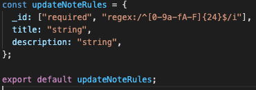
* `_id` is a required data, and the regex specified that it should be an `ObjectId`.
* `title` and `description` is expected to be a string.

If the data passed in fails the validation (e.g. missing route parameter, missing data in the message body, invalid data type, fails the regex), the status code is `422`.

If an error is encountered during the execution of a query, such as a record not found or an internal error, the status code will be `404`.

Please refer to the [demonstration](#Demonstration) section for the use-cases.

<div style="page-break-after: always;"></div>

###  1.4. <a name='Endpoint'></a>Endpoint
- Localhost: [http://localhost:5000](http://localhost:5000)
- Deployed: [https://asia-southeast1-cs3219-otot-task-b-325509.cloudfunctions.net/cs3219-otot-task-b-dev-app](https://asia-southeast1-cs3219-otot-task-b-325509.cloudfunctions.net/cs3219-otot-task-b-dev-app)

All the API endpoints are structured in this format `{URL}/api/{COLLECTION_NAME}`.

**Note API**

Method | Route | Description
--- | --- | ---
POST | /api/note | Create a new note
GET | /api/note | Get all notes
GET | /api/note/:note_id | Get note by ID
PUT | /api/note | Update a note 
DELETE | /api/note/:note_id | Soft delete a note 
DELETE | /api/note/hard-delete/:note_id | Hard delete a note 

- The results returned by the API must be `data` or `errors` (following the [Google JSON guide](https://google.github.io/styleguide/jsoncstyleguide.xml)).
- For `GET`, there are two variants: one will get a specific record by `ID` while the other will get all the records from the database.
- For `DELETE`, there are two variants: one will perform a soft delete while the another will perform a hard delete.
- E.g. to call the GET `/api/note` locally, one can make a GET request to `http://localhost:5000/api/note`.
- Please follow the [demonstration](#Demonstration) for each endpoint explanation.

[](https://app.getpostman.com/run-collection/15996177-68774c59-8469-4d19-a83a-7231bf26b25f?action=collection%2Ffork&collection-url=entityId%3D15996177-68774c59-8469-4d19-a83a-7231bf26b25f%26entityType%3Dcollection%26workspaceId%3D6697fc46-4dcf-48ae-809d-2103f45bab94#?env%5BCS3219-TaskB%5D=W3sia2V5Ijoibm90ZV9pZCIsInZhbHVlIjoiIiwiZW5hYmxlZCI6dHJ1ZX0seyJrZXkiOiJhY2Nlc3NfdG9rZW4iLCJ2YWx1ZSI6IiIsImVuYWJsZWQiOmZhbHNlfSx7ImtleSI6InVzZXJfaWQiLCJ2YWx1ZSI6IiIsImVuYWJsZWQiOmZhbHNlfV0=)
* Recommended to import to your workspace

Alternatively, you may want to import it to your workspace via the [JSON link](https://www.getpostman.com/collections/f6491072cef6295e5d56) or download the Postman JSON file in the [Github Directory](https://github.com/glatiuden/CS3219-OTOT-TaskB/blob/master/backend/CS3219-TaskB.postman_collection.json).

**Important**! Please set the environment to `CS3219-TaskB` on the top right-hand corner of the Postman window.

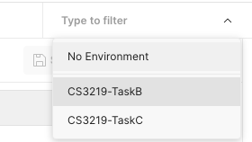

<div style="page-break-after: always;"></div>

###  1.5. <a name='Demonstration'></a>Demonstration
All the request methods, endpoints and necessary data or parameters are set in the Postman collection above. Therefore, it is recommended to follow through with the screenshots using the Postman collection.
<small>Pictures may appear a bit small on the PDF. Please zoom in for a better viewing experience. Alternatively, you may refer to the repository's README.</small>

####  1.5.1. <a name='POSTCREATE'></a>POST (CREATE)
- Method: `POST`
- Route: `/api/note`
	- Localhost: [http://localhost:5000/api/note/](http://localhost:5000/api/note/)
	- Deployed: [https://asia-southeast1-cs3219-otot-task-b-325509.cloudfunctions.net/cs3219-otot-task-b-dev-app/api/note/](https://asia-southeast1-cs3219-otot-task-b-325509.cloudfunctions.net/cs3219-otot-task-b-dev-app/api/note/)
- Description: Create new note
- Data (JSON): `title` (required), `description` (required)

**Success (200)**
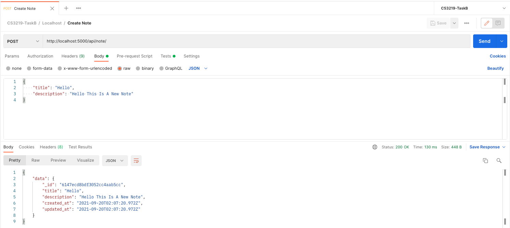

* For ease of demonstration and testing, the `note_id` returned in the body will be saved as a variable in Postman's local environment to be used in the subsequent requests.
* Please set the environment to `CS3219-TaskB` on the top right-hand corner if you missed out the instruction [above](#Endpoint).
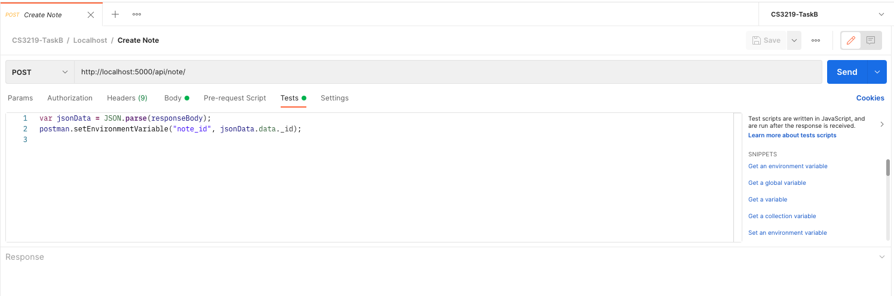

<div style="page-break-after: always;"></div>

**Error (422)**
* Occurs due to missing required data fields (e.g. `title` and `description`).

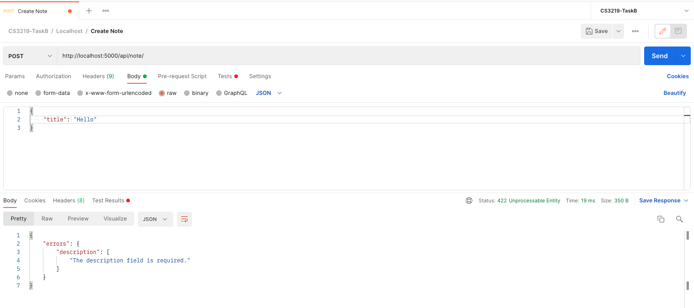

* Occurs due to invalid data fields (e.g. `title` must be a string but was given an integer)


* Optimally, there can be an additional Error `404` if a note with the same `title` and `description` already exists in the database. However, this error is omitted from the implementation as it does not fit a note application's context and the ease of testing.

<div style="page-break-after: always;"></div>

####  1.5.2. <a name='GETRetrieve'></a>GET (Retrieve)
- Method: `GET`
- Route: `/api/note`
	- Localhost: [http://localhost:5000/api/note/](http://localhost:5000/api/note/)
	- Deployed: [https://asia-southeast1-cs3219-otot-task-b-325509.cloudfunctions.net/cs3219-otot-task-b-dev-app/api/note/](https://asia-southeast1-cs3219-otot-task-b-325509.cloudfunctions.net/cs3219-otot-task-b-dev-app/api/note/)
- Description: Get all notes
- Parameter: `query` (optional)

**Success (200)**


* To perform server-side filtering, we can pass additional URL query parameter to search for notes e.g. `/api/note?query=homework`.
	- Localhost: [http://localhost:5000/api/note?query=homework](http://localhost:5000/api/note?query=homework)
	- Deployed: [https://asia-southeast1-cs3219-otot-task-b-325509.cloudfunctions.net/cs3219-otot-task-b-dev-app/api/note?query=homework](https://asia-southeast1-cs3219-otot-task-b-325509.cloudfunctions.net/cs3219-otot-task-b-dev-app/api/note?query=homework)

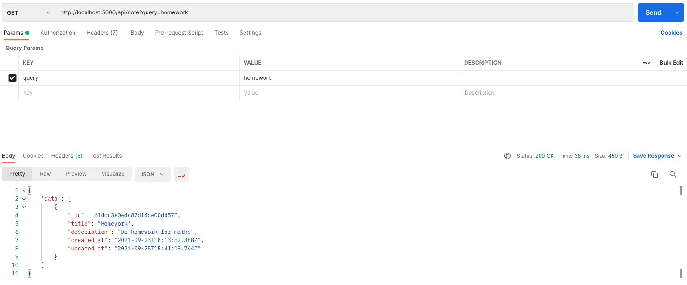

* Optionally, it can be an additional Error `204` (no content) if no notes are in the collections. 
* I believe it's a debate between 204 and returning 200 with an empty array. For this task, I have chosen to follow 200 with an empty array.

<div style="page-break-after: always;"></div>

####  1.5.3. <a name='GETRetrieveByID'></a>GET (Retrieve By ID)
- Method: `GET`
- Route: `/api/note/:note_id`
	- Localhost: [http://localhost:5000/api/note/](http://localhost:5000/api/note/):note_id
	- Deployed: [https://asia-southeast1-cs3219-otot-task-b-325509.cloudfunctions.net/cs3219-otot-task-b-dev-app/api/note/](https://asia-southeast1-cs3219-otot-task-b-325509.cloudfunctions.net/cs3219-otot-task-b-dev-app/api/note/):note_id
- Description: Get note by ID

**Success (200)**
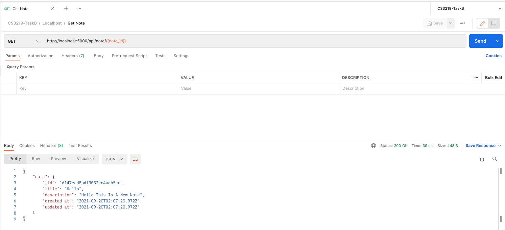

**Error (404)**
* Occurs when the parameter (`note_id`) is valid and present, but the record is not found in the database

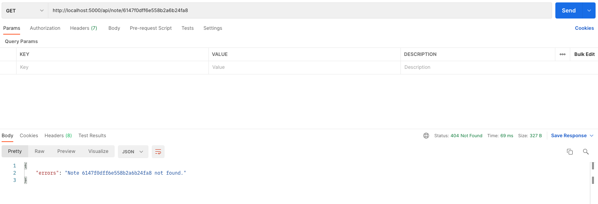

<div style="page-break-after: always;"></div>

**Error (422)**
* Occurs when the parameter is invalid (e.g. the `note_id` is not a valid ObjectId).

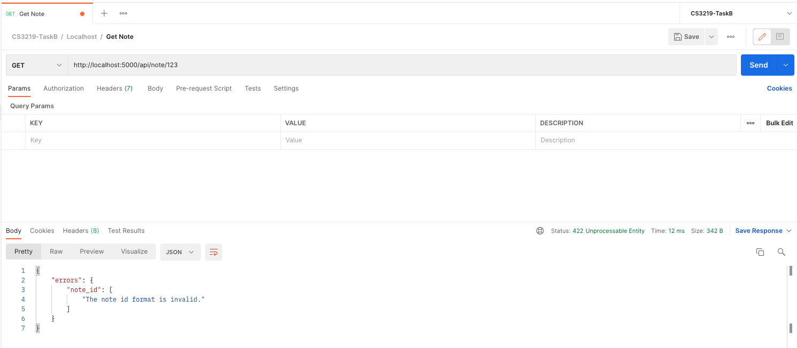

<div style="page-break-after: always;"></div>

####  1.5.4. <a name='PUTUpdate'></a>PUT (Update)
- Method: `PUT`
- Route: `/api/note/`
	- Localhost: [http://localhost:5000/api/note/](http://localhost:5000/api/note/)
	- Deployed: [https://asia-southeast1-cs3219-otot-task-b-325509.cloudfunctions.net/cs3219-otot-task-b-dev-app/api/note/](https://asia-southeast1-cs3219-otot-task-b-325509.cloudfunctions.net/cs3219-otot-task-b-dev-app/api/note/)
- Description: (Partial) Update existing note
- Data (JSON): `_id` (required), `title` (optional), `description` (optional)

**Success (200)**
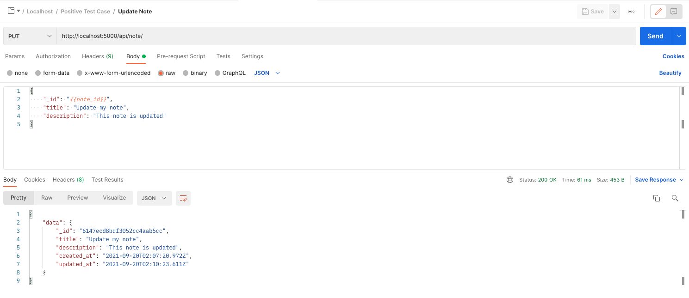

**Error (404)**
* Occurs when the body data (`_id`) is valid and present, but the record is not found in the database


<div style="page-break-after: always;"></div>

**Error (422)**
* Occurs when `_id` is missing
* As it is updating a note, `_id` is required to know which record to update.


* Occurs when `_id` is invalid (needs to be a valid ObjectID) or other fields (e.g. `title` needs to be a string)


<div style="page-break-after: always;"></div>

####  1.5.5. <a name='DELETESoftDelete'></a>DELETE (Soft Delete)
- Method: `DELETE`
- Route: `/api/note/:note_id`
	- Localhost: [http://localhost:5000/api/note/](http://localhost:5000/api/note/):note_id
	- Deployed: [https://asia-southeast1-cs3219-otot-task-b-325509.cloudfunctions.net/cs3219-otot-task-b-dev-app/api/note/](https://asia-southeast1-cs3219-otot-task-b-325509.cloudfunctions.net/cs3219-otot-task-b-dev-app/api/note/):note_id
- Description: Soft delete an existing note

**Success (200)**


**Error (404)**
* Occurs when the parameter (`note_id`) is valid and present, but the record has already been soft-deleted

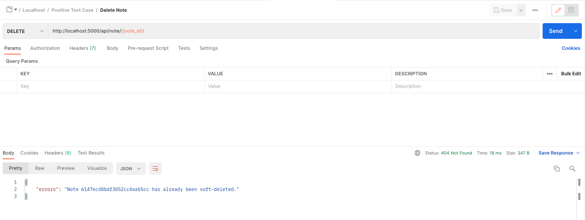

<div style="page-break-after: always;"></div>

* Occurs when the parameter (`note_id`) is valid and present, but the record is not found in the database

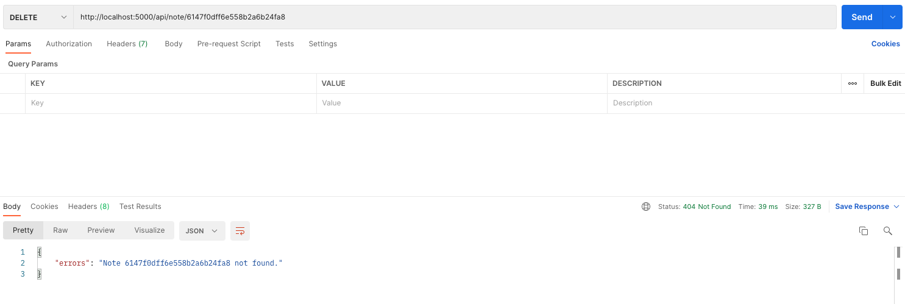

**Error (422)**
* Caused by an invalid parameter (In this scenario, the `note_id` is not a valid ObjectId).
* As it is soft deleting a note, `note_id` is required to know which record to soft delete.


<div style="page-break-after: always;"></div>

####  1.5.6. <a name='DELETEHardDelete'></a>DELETE (Hard Delete)
- Method: `DELETE`
- Route: `/api/note/hard-delete/:note_id`
	- Localhost: [http://localhost:5000/api/note/hard-delete/](http://localhost:5000/api/note/hard-delete/):note_id
	- Deployed: [https://asia-southeast1-cs3219-otot-task-b-325509.cloudfunctions.net/cs3219-otot-task-b-dev-app/api/note/hard-delete/](https://asia-southeast1-cs3219-otot-task-b-325509.cloudfunctions.net/cs3219-otot-task-b-dev-app/api/note/hard-delete/):note_id

- Description: Hard delete an existing note

**Success (200)**
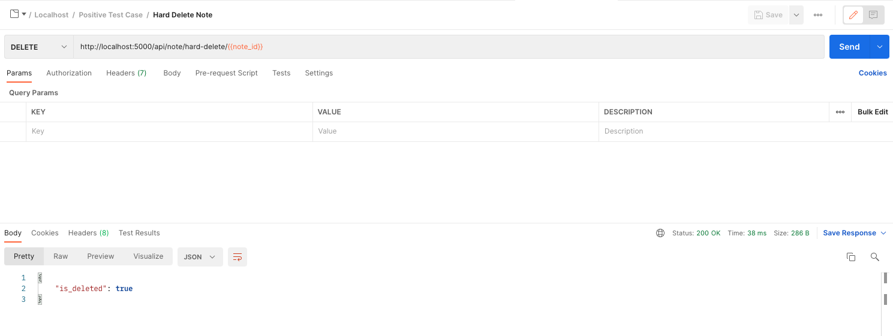

**Error (404)**
* Occurs when the parameter (`note_id`) is valid and present, but the record is not found in the database


<div style="page-break-after: always;"></div>

**Error (422)**
* Caused by an invalid parameter (In this scenario, the `note_id` is not a valid ObjectId).
* As it is hard deleting a note, `note_id` is required to know which record to hard delete. 


**References**
- [Using Clean Architecture for Microservice APIs in Node.js with MongoDB and Express](https://www.freecodecamp.org/news/video-clean-architecture-in-node-js/)
- [Rules for clean code](https://blog.logrocket.com/the-perfect-architecture-flow-for-your-next-node-js-project/)
- [Node clean code architecture](https://roystack.home.blog/2019/10/22/node-clean-architecture-deep-dive/)
- [Application layer - use-cases](https://khalilstemmler.com/articles/enterprise-typescript-nodejs/application-layer-use-cases/)
- [Domain-driven Design articles](https://khalilstemmler.com/articles/categories/domain-driven-design/)
- [Screaming architecture](http://blog.cleancoder.com/uncle-bob/2011/09/30/Screaming-Architecture.html)
- [What is screaming architecture](https://levelup.gitconnected.com/what-is-screaming-architecture-f7c327af9bb2)
- [Clean architecture use-case structure](https://proandroiddev.com/why-you-need-use-cases-interactors-142e8a6fe576)
- [Denormalize data](https://www.mongodb.com/blog/post/6-rules-of-thumb-for-mongodb-schema-design-part-3)
- [Mongoose Database](https://mongoosejs.com/docs/guide.html)
- [Expression documentation on API](https://expressjs.com/en/api.html)
- [Bodyparser](https://github.com/expressjs/body-parser)
- [Winston-express for HTTP logging](https://github.com/bithavoc/express-winston)
- [Winston for error logging](https://www.npmjs.com/package/winston#combining-formats)
- [Regex route express](https://www.kevinleary.net/regex-route-express/)

<div style="page-break-after: always;"></div>

##  2. <a name='TaskB2:TestingthroughContinuousIntegrationCI'></a>Task B2: Testing through Continuous Integration (CI)
**Test Frameworks**: [Mocha](https://www.npmjs.com/package/mocha) & [Chai](https://www.npmjs.com/package/chai)

###  2.1. <a name='SetUp-1'></a>Set Up

The [tests](https://github.com/glatiuden/CS3219-OTOT-TaskB/blob/master/backend/src/tests/test.ts) are split into positive and negative test cases, which will test all the available methods, which consist of `POST` (create), `GET` (retrieve by ID & retrieve all), `PUT` (update) and `DELETE` (soft delete and hard delete). This ensures that the API endpoints status and responses are accurate.

The tests are defined in [src/tests/test.ts](https://github.com/glatiuden/CS3219-OTOT-TaskB/blob/master/backend/src/tests/test.ts).

Code snippet from [index.ts](https://github.com/glatiuden/CS3219-OTOT-TaskB/blob/master/backend/index.ts)

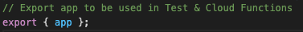

* To test the endpoints, `app` is exported from [index.ts](https://github.com/glatiuden/CS3219-OTOT-TaskB/blob/master/backend/index.ts), which will be invoked whenever the test runs.

* To test locally, we can run the test via `npm run test` command.

###  2.2. <a name='PostiveTestCases'></a>Postive Test Cases

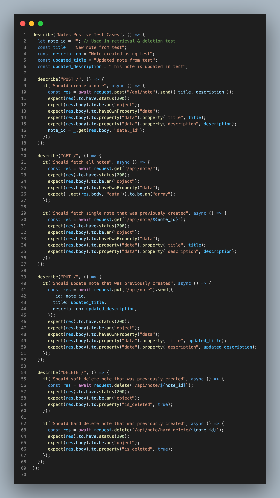

* The response status code from the endpoint should be `200`.
* For create, retrieve by ID and update, the response data should match the value that was passed in.
* For retrieve all, the response should be an array of data.
* For delete, the `is_deleted` value should be true.

<div style="page-break-after: always;"></div>

###  2.3. <a name='NegativeTestCases'></a>Negative Test Cases

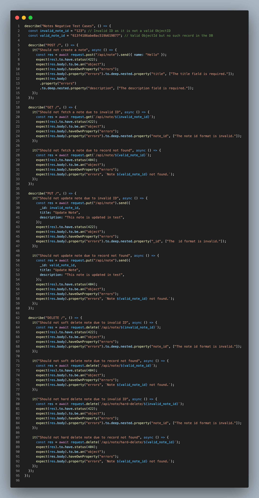

* The response status code should be either be `404` or `422`.
* For an attempt to create a note with invalid data, the status code should be `404` and an error message stating which fields are missing.
* For an attempt to retrieve, update, soft-delete, and hard-delete note with an invalid `_id` (ObjectId), the status code should be `422` and an error message stating the id format is invalid.
* For an attempt to retrieve, update, soft-delete and hard-delete note with a valid `_id` (ObjectId) but the record does not exist in the database, the status code should be `404` and an error message stating "Note {note_id} is not found."

<div style="page-break-after: always;"></div>

###  2.4. <a name='RunningthetestthroughCI'></a>Running the test through CI
Code Snippet from [.travis.yml](https://github.com/glatiuden/CS3219-OTOT-TaskB/blob/master/.travis.yml)


For this task, Travis has been integrated into the repository. Before it runs the jobs, it will perform `cd backend` and run `npm install` to install the necessary modules and libraries.

For CI, under jobs, a stage named `test` is created. 
`npm run test` is executed whenever the codes are pushed into the repository, which will execute the tests as defined above.

The MongoDB Atlas credentials have also been set in Travis's Environment Variables for CI/CD purposes.

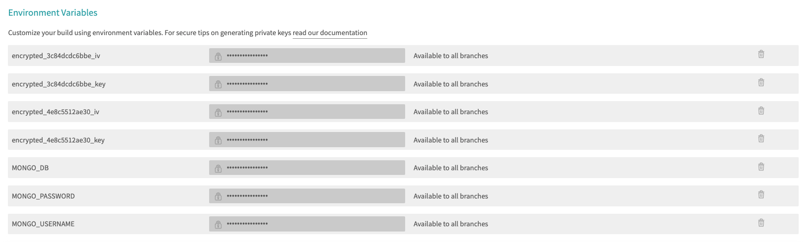

This is a screenshot of an example of the test.
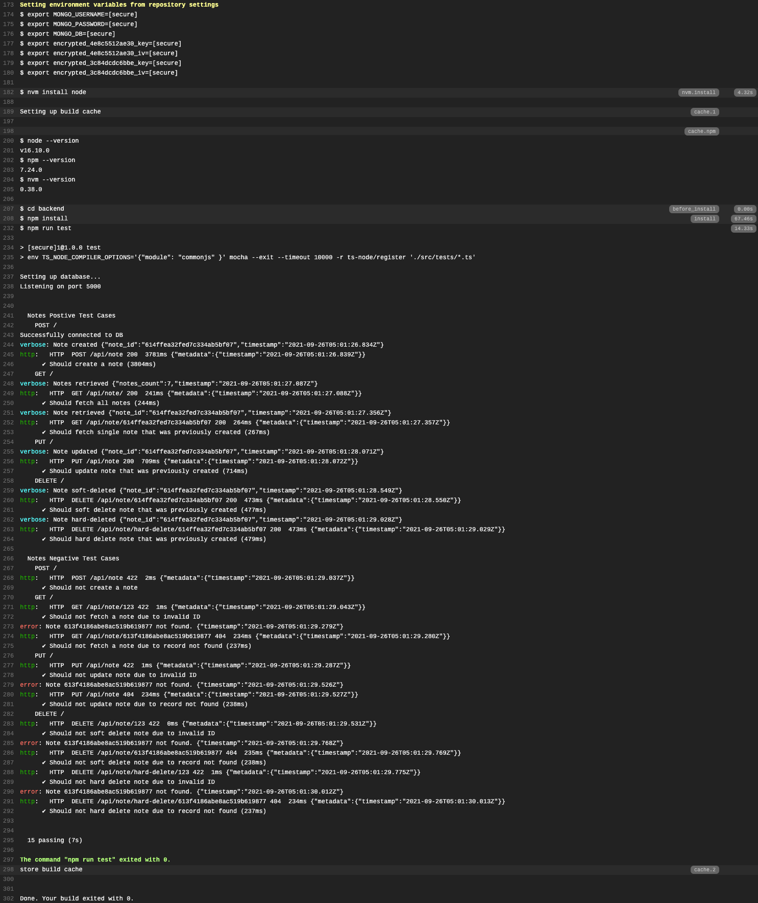

**References**
- [https://medium.com/@asciidev/testing-a-node-express-application-with-mocha-chai-9592d41c0083](https://medium.com/@asciidev/testing-a-node-express-application-with-mocha-chai-9592d41c0083)
- [https://gist.github.com/cklanac/81a6f49fabb52b3c95dff397fe62c771](https://gist.github.com/cklanac/81a6f49fabb52b3c95dff397fe62c771)

<div style="page-break-after: always;"></div>

##  3. <a name='TaskB3:DeploymentthroughContinuousDeploymentCD'></a>Task B3: Deployment through Continuous Deployment (CD)
**Serverless Service**: Serverless Google Cloud Functions

For this task, the backend server has been deployed using the Serverless Google Cloud Functions Provider.

###  3.1. <a name='SetUp-1'></a>Set Up

####  3.1.1. <a name='Travis'></a>Travis

Code snippet from [.travis.yml](https://github.com/glatiuden/CS3219-OTOT-TaskB/blob/master/.travis.yml)

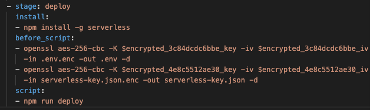

Continuing from the `.travis.yml` file that was created in Task B2, a new job stage named `deploy` was created for CD.

Before it runs `script`, it will decrypt the Google Cloud Application credentials key file credentials required for deployment.
Then, it will install the `serverless` npm package then run the `npm run deploy` command, which is actually doing a `serverless deploy`.

<div style="page-break-after: always;"></div>

####  3.1.2. <a name='Serverless'></a>Serverless
A [serverless.yml](https://github.com/glatiuden/CS3219-OTOT-TaskB/blob/master/backend/serverless.yml) has been set up as a set of instructions to deploy to Google Cloud Functions.

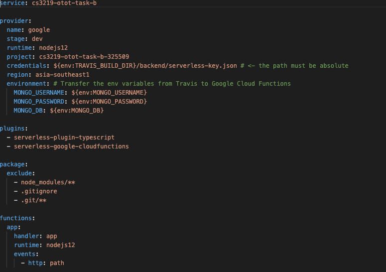

As it is using Google's Service Account for deployment, it will use the credentials keyfile decrypted by Travis when the job `deploy` is run.

Afterwards, it will transfer the environment variables from Travis to Serverless Google Cloud Functions by exposing them under the provider's environment.

For the function, `app` is exported from [index.ts](https://github.com/glatiuden/CS3219-OTOT-TaskB/blob/master/backend/index.ts), which will be invoked whenever the Google Cloud Functions endpoint is called.

Code snippet from [index.ts](https://github.com/glatiuden/CS3219-OTOT-TaskB/blob/master/backend/index.ts)


* To test everything is working properly, we can also do a local deployment `npm run deploy` to ensure the configuration is properly set up.

<div style="page-break-after: always;"></div>

###  3.2. <a name='DeployingthroughCD'></a>Deploying through CD

You may view the Travis Build History [here](https://app.travis-ci.com/github/glatiuden/CS3219-OTOT-TaskB/builds/238483784).

This is a screenshot of an example of continuous deployment.

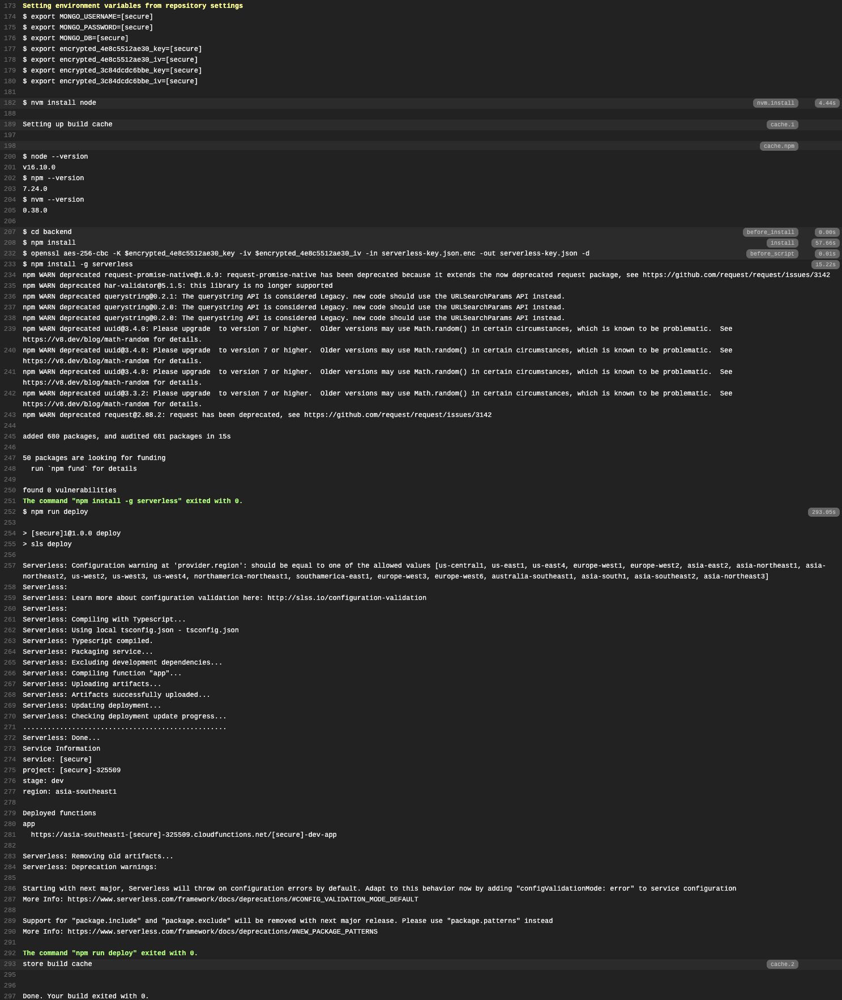

The application is deployed to [https://asia-southeast1-cs3219-otot-task-b-325509.cloudfunctions.net/cs3219-otot-task-b-dev-app](https://asia-southeast1-cs3219-otot-task-b-325509.cloudfunctions.net/cs3219-otot-task-b-dev-app).

<div style="page-break-after: always;"></div>

**Google Cloud Console**

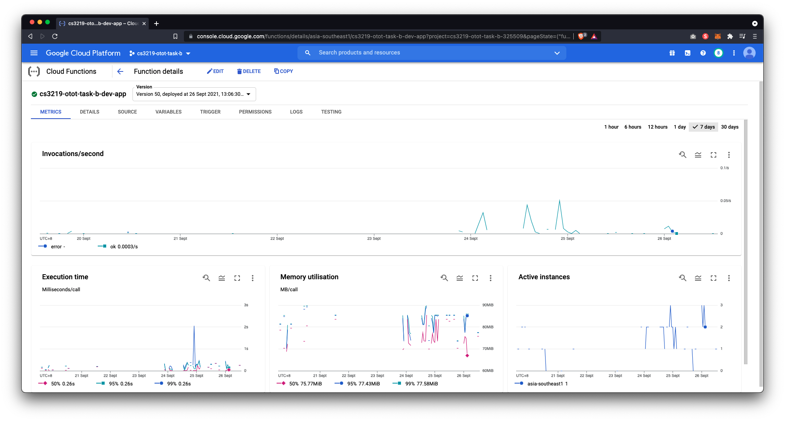

**References**
- [https://www.serverless.com/framework/docs/providers/google/guide](https://www.serverless.com/framework/docs/providers/google/guide)
- [https://blog.travis-ci.com/2019-05-30-setting-up-a-ci-cd-process-on-github](https://blog.travis-ci.com/2019-05-30-setting-up-a-ci-cd-process-on-github)

<div style="page-break-after: always;"></div>

##  4. <a name='TaskB4:Implementafrontend'></a>Task B4: Implement a frontend

This is an attempt in creating a frontend using Next.js using Material-UI to build a responsive web application.

The web application supports the CRUD operations created in Task B1.

To fulfil the learning objectives, the codes are structured in an MVC folder structure (which might not be conventional), along with using React's useReducer and Store context.

###  4.1. <a name='SetUp-1'></a>Set Up
- **Frontend Framework**: [Next.js](https://nextjs.org/) (Framework of React.js)
- **UI Framework**: [Material-UI](https://v4.mui.com/)
- **Additional Libraries Used**: [Notistack](https://github.com/iamhosseindhv/notistack) and [React Masonry CSS](https://www.npmjs.com/package/react-masonry-css)

Please ensure you are in the `frontend` directory (`cd frontend`).

Please create a `.env` file with the following variables:
```
DB_HOST_URL = "https://asia-southeast1-cs3219-otot-task-b-325509.cloudfunctions.net/cs3219-otot-task-b-dev-app"
```

**Install the necessary modules**
```
npm install
```

**Start the server**
```
npm run dev
```

###  4.2. <a name='Endpoint-1'></a>Endpoint
- Localhost: [http://localhost:3000](http://localhost:3000)
- Deployed: [https://cs3219-otot-task-b-325509.as.r.appspot.com/](https://cs3219-otot-task-b-325509.as.r.appspot.com/)

<div style="page-break-after: always;"></div>

###  4.3. <a name='Demonstration-1'></a>Demonstration

**Desktop View**
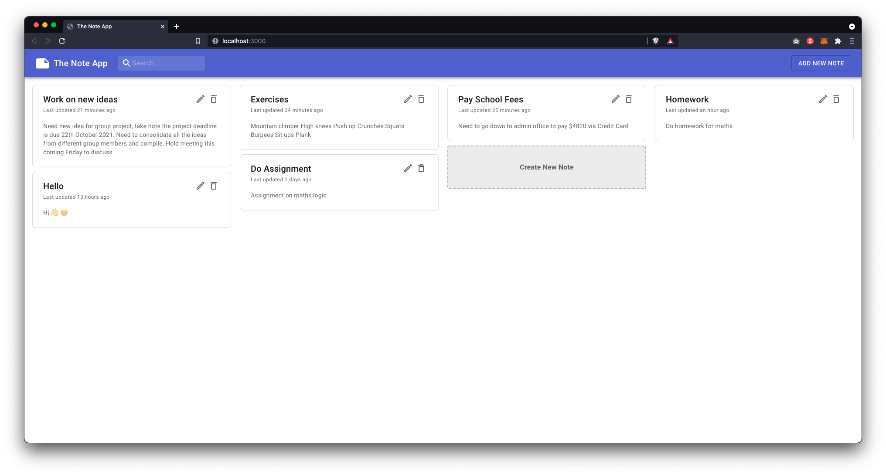

**Tablet / Smaller Screen View**
<div align="center">
  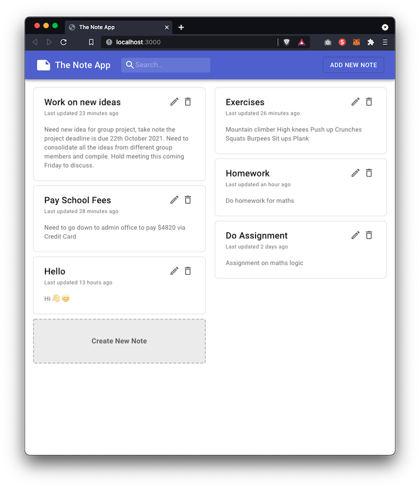
</div>

**Mobile View**
<div align="center">
  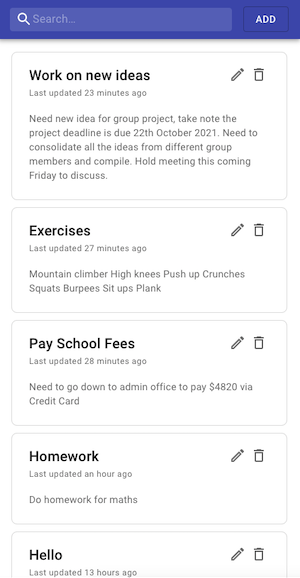
</div>

<div style="page-break-after: always;"></div>

####  4.3.1. <a name='Create'></a>Create
- You can open the create dialog by either pressing `Add New Note` on the top right or the `Create New Note` placeholder card in the masonry grid.

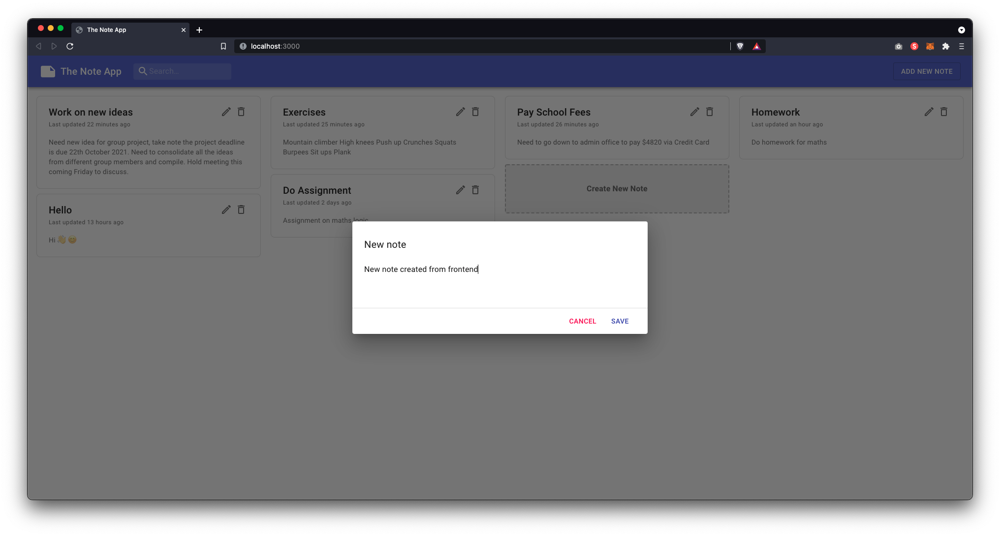

- After the note is created, a notification will appear on the bottom right of the screen, and the new note is displayed as the first item in the masonry grid.

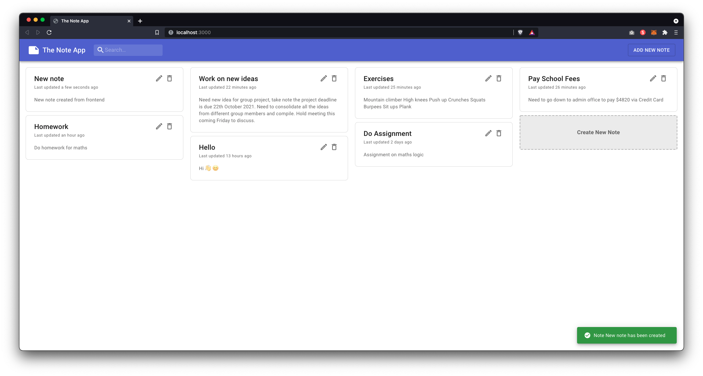

<div style="page-break-after: always;"></div>

####  4.3.2. <a name='Retrieve'></a>Retrieve
- Each note card consist of `title`, `description` and last `updated_at` information.
- There is an edit and delete button to the right of the card.

<div align="center">
  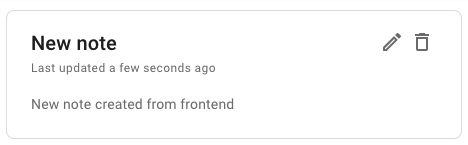
</div>

- You can perform searching (server-side filtering) by typing in the search box in the app bar.

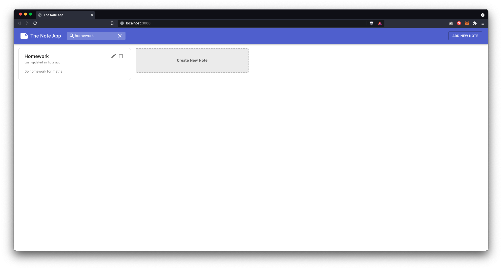

<div style="page-break-after: always;"></div>

####  4.3.3. <a name='Update'></a>Update
- Click the edit (pencil) button on the card, and the update dialog should appear.

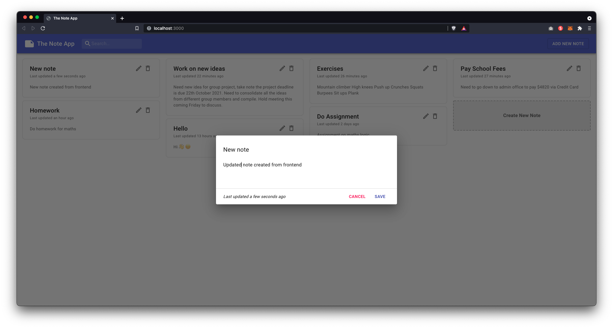

- After the note is created, a notification will appear on the bottom right of the screen, and the updated note is displayed as the first item in the masonry grid.

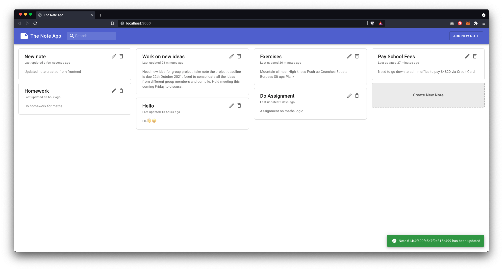

<div style="page-break-after: always;"></div>

####  4.3.4. <a name='Delete'></a>Delete
- Click the delete (trash) button on the card, and a delete warning should appear.

<div align="center">
  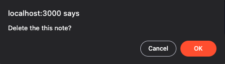
</div>

- After the note is deleted, a notification will appear on the bottom right of the screen, and the note is removed from the masonry grid.

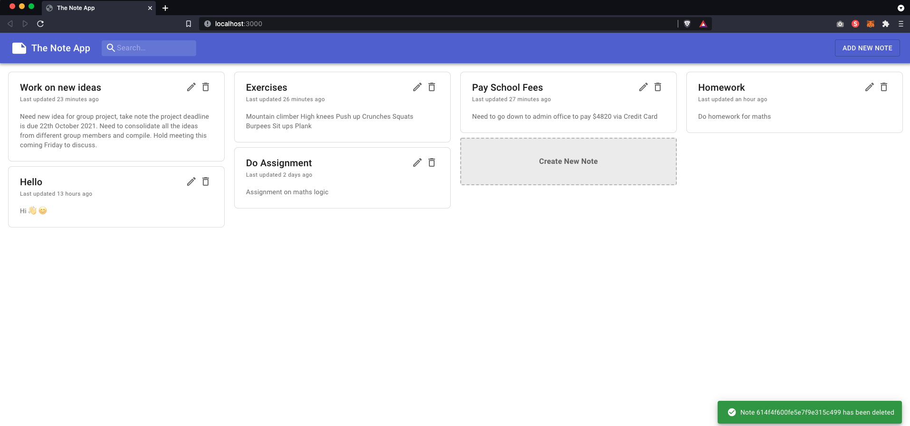

**Learning Outcome**
- Despite the learning objectives being to use an MVC in real-life frameworks, the newer frameworks are no longer based on the "MVC" structure.
- The closest thing to MVC was Redux, which goes from Reducer -> Store -> View.
- In this task, I tried to replicate as closely as possible by utilizing controllers (which will interact with the APIs) and models (to define the attributes) while using React's reducer and store functionality.

**References**
- [https://nextjs.org/learn/basics/create-nextjs-app](https://nextjs.org/learn/basics/create-nextjs-app)
- [https://hmh.engineering/using-react-contextapi-usereducer-as-a-replacement-of-redux-as-a-state-management-architecture-336452b2930e](https://hmh.engineering/using-react-contextapi-usereducer-as-a-replacement-of-redux-as-a-state-management-architecture-336452b2930e)
