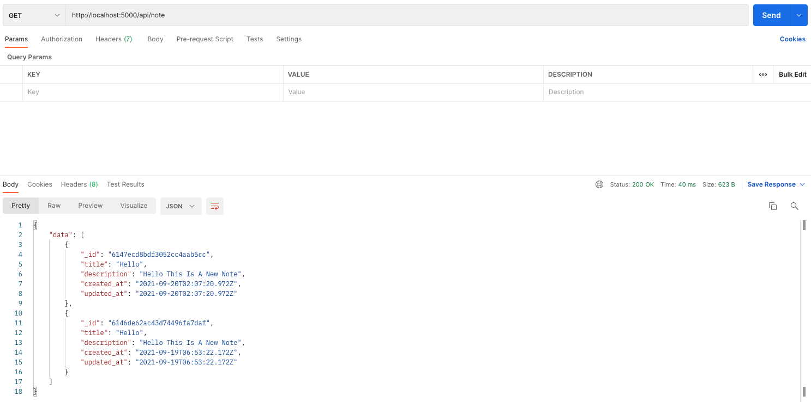
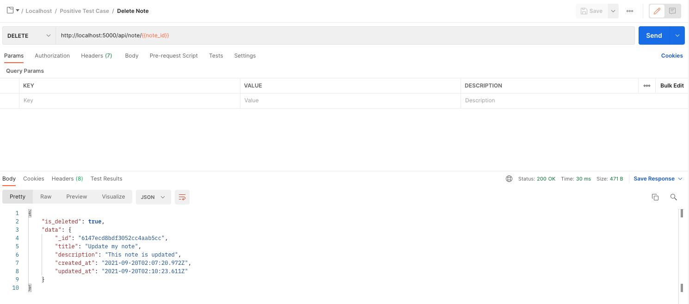
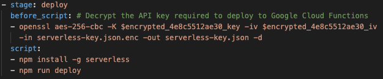

# CS3219 Task B: CRUD Application Task
**Name**: Koh Vinleon <br/>
**Matric Number**: A0202155W <br/>
**GitHub Link**: https://github.com/glatiuden/CS3219-OTOT-TaskB<br/>

## Task B1: Implementing Backend
This is an attempt in building a (semi) Clean Architecture Node.js backend.

### Clean Architecture


<br/>Read more at [Clean Coder Blog](https://blog.cleancoder.com/uncle-bob/2012/08/13/the-clean-architecture.htmllink)

#### Layer description:

- Entities: Contain enterprise business model/object
- Use Cases: Contain application business rules/logic
- Interface Adapter: Contains a set of adapters that convert data from entities/use-case layer to external dependencies such as DB or Web/HTTP
- Frameworks/Driver: Compose of frameworks and tools (DB, Web Frameworks)

**References**
- [Using Clean Architecture for Microservice APIs in Node.js with MongoDB and Express](https://www.freecodecamp.org/news/video-clean-architecture-in-node-js/)
- [Rules for clean code](https://blog.logrocket.com/the-perfect-architecture-flow-for-your-next-node-js-project/)
- [Node clean code architecture](https://roystack.home.blog/2019/10/22/node-clean-architecture-deep-dive/)
- [Application layer - use-cases](https://khalilstemmler.com/articles/enterprise-typescript-nodejs/application-layer-use-cases/)
- [Domain-driven Design articles](https://khalilstemmler.com/articles/categories/domain-driven-design/)
- [Screaming architecture](http://blog.cleancoder.com/uncle-bob/2011/09/30/Screaming-Architecture.html)
- [What is screaming architecture](https://levelup.gitconnected.com/what-is-screaming-architecture-f7c327af9bb2)
- [Clean architecture use-case structure](https://proandroiddev.com/why-you-need-use-cases-interactors-142e8a6fe576)
- [Denormalize data](https://www.mongodb.com/blog/post/6-rules-of-thumb-for-mongodb-schema-design-part-3)
- [Mongoose Database](https://mongoosejs.com/docs/guide.html)
- [Expression documentation on API](https://expressjs.com/en/api.html)
- [Bodyparser](https://github.com/expressjs/body-parser)
- [Winston-express for HTTP logging](https://github.com/bithavoc/express-winston)
- [Winston for error logging](https://www.npmjs.com/package/winston#combining-formats)
- [Regex route express](https://www.kevinleary.net/regex-route-express/)

### Set Up
**Database Used**: Atlas MongoDB
**Third Party API Used**: Winston Loggers, Nodemon
Please ensure you are in the `/backend` folder (`cd backend`). 

Please create a `.env` file in the backend directory with the following credentials.
```
MONGO_USERNAME="admin"
MONGO_PASSWORD="3YHYkUdqNUMykugo"
MONGO_DB="cs3219-otot-task-b"
```

#### Install the necessary modules
```
npm install
```

#### Start the server
```
npm run dev
```

#### Design
- All the endpoints are structured in this format `{URL}/api/{COLLECTION_NAME}`.

Note API
Method | Route | Description
--- | --- | ---
POST | /api/note | Create a new note
GET | /api/note | Get all notes
GET | /api/note/:note_id | Get note by ID
PUT | /api/note | Update a note 
DELETE | /api/note/:note_id | Soft delete a note 
DELETE | /api/note/hard-delete/:note_id | Hard delete a note 

- The results returned by the API must be `data`.
- For `GET`, there are two variants: one will get a specific record by `ID` while the other will get all the records from the database.
- For `DELETE`, there are two variants: one will perform a soft delete while the another will perform a hard delete.

#### Error Resiliency
- The controllers which require parameters use a validator middleware to ensure the required parameters are in place. If there are missing parameters or invalid data, the response (error) code is `422`.
- If there is an error encountered during the execution of a query, such as a record not found or an internal error, the response (error) code will be `404`.

#### Endpoint
- Localhost: http://localhost:5000
- Deployed Endpoint: https://asia-southeast1-cs3219-otot-task-b-325509.cloudfunctions.net/cs3219-otot-task-b-dev-app

[](https://app.getpostman.com/run-collection/15996177-e300afc6-2c27-40cc-8628-be5a541d2ddd?action=collection%2Ffork&collection-url=entityId%3D15996177-e300afc6-2c27-40cc-8628-be5a541d2ddd%26entityType%3Dcollection%26workspaceId%3D6697fc46-4dcf-48ae-809d-2103f45bab94#?env%5BCS3219-TaskB%5D=W3sia2V5Ijoibm90ZV9pZCIsInZhbHVlIjoiIiwiZW5hYmxlZCI6dHJ1ZX0seyJrZXkiOiJhY2Nlc3NfdG9rZW4iLCJ2YWx1ZSI6IiIsImVuYWJsZWQiOnRydWV9LHsia2V5IjoidXNlcl9pZCIsInZhbHVlIjoiIiwiZW5hYmxlZCI6dHJ1ZX1d)

Alternatively, you may want to import it to your workspace via the JSON link: https://www.getpostman.com/collections/f6491072cef6295e5d56

#### Demonstration

#### POST (CREATE)
- Method: `POST`
- Endpoint: `/api/note`
- Description: Create new note
- Data Required (JSON): `title` (required), `description` (required)

##### Success (200)


* For ease of demonstration and testing, the `note_id` returned in the body will be saved as a variable in Postman's local environment to be used in the subsequent requests.


#### Missing fields (422)


* Optimally, there can be an additional Error `404` if the note with the same `title` and `description` already exists in the database. However, this is omitted as it does not fit the context of a "note" application and for ease of testing.

#### GET (Retrieve)
- Method: `GET`
- Endpoint: `/api/note`
- Description: Get all notes

##### Success (200)


* Optimally, it can be a 204 (no content) if no notes are in the collections. However, I believe it's a debate between returning 200 with an empty array. 
* For this task, I have chosen to follow 200 with an empty array.

#### GET (Retrieve By ID)
- Method: `GET`
- Endpoint: `/api/note/:note_id`
- Description: Get all notes

##### Success (200)


#### Valid parameter but data not found (404)


#### Invalid parameter (422)


#### PUT (Update)
- Method: `PUT`
- Endpoint: `/api/note/`
- Description: (Partial) Update existing note
- Data Required (JSON): `_id`, `title` (optional), `description` (optional)

##### Success (200)


#### Valid parameter but data not found (404)


#### Missing `_id` (422)

* As we are updating a note, `_id` is required to know which record to update.

#### Delete (Soft Delete)
- Method: `DELETE`
- Endpoint: `/api/note/:note_id`
- Description: Soft-delete an existing note

##### Success (200)


#### Valid parameter but data already soft-deleted (404)


#### Valid parameter but data not found (404)


#### Invalid parameter `_id` (422)

* As we are soft deleting a note, `_id` is required to know which record to soft delete.

#### Delete (Hard Delete)
- Method: `DELETE`
- Endpoint: `/api/note/:note_id`
- Description: Soft-delete an existing note

##### Success (200)


#### Valid parameter but data not found (404)


#### Invalid parameter `_id` (422)

* As we are hard deleting a note, `_id` is required to know which record to hard delete.

## Task B2: Testing through Continuous Integration (CI)
**Test Framework**: Mocha & Chai

The test cases are split into positive and negative test cases.
This is to ensure that the API response should be accurate (200, 404, 422).

#### Run the test locally
```
npm run test
```

The tests will perform a check on all the available requests `POST`, `GET` (get by ID & get all), `PUT` and `DELETE` (soft delete and hard delete).

#### Running the test through CI
Snippet from `.travis.yml`

Travis has been integrated into the repository. ```npm run test``` is executed whenever the codes are pushed into the repository, under the job stage `test`.

This is a screenshot of an example of the test.


**References**
- https://medium.com/@asciidev/testing-a-node-express-application-with-mocha-chai-9592d41c0083
- https://gist.github.com/cklanac/81a6f49fabb52b3c95dff397fe62c771


## Task B3: Deployment through Continuous Deployment (CD)
**Serverless Service**: Serverless Google Cloud Functions

This task is accomplished using the Serverless Framework via Google Cloud Functions.
A `serverless.yml` has been set up as a set of instructions to deploy to Google Cloud Functions.
We can either deploy locally or via continuous delivery in Travis.

#### Deploying locally
```
npm run deploy
```

#### Deploying through CD
Similar to Task B2, ```npm run deploy``` under the job stage `deploy` is executed whenever the codes are pushed into the repository after the `test` stage is completed. 

Snippet from `.travis.yml`


This is a screenshot of an example of continuous deployment.


The application is deployed to https://asia-southeast1-cs3219-otot-task-b-325509.cloudfunctions.net/cs3219-otot-task-b-dev-app.

**References**
- https://www.serverless.com/framework/docs/providers/google/guide
- https://blog.travis-ci.com/2019-05-30-setting-up-a-ci-cd-process-on-github

## Task B4: Implement a frontend
- **Frontend Framework**: Next.js (React.js)
- **UI Framework**: Material-UI

This is an attempt in creating a frontend using Next.js.
The web application supports the CRUD operations created in Task B1.

As part of the learning objectives, the codes are structured in an MVC folder structure, along with using React's useReducer as a store.

Please ensure you are in the `frontend` directory (`cd frontend`).

Please create a `.env` file with the following variables:
```
DB_HOST_URL = "https://asia-southeast1-cs3219-otot-task-b-325509.cloudfunctions.net/cs3219-otot-task-b-dev-app"
```

#### Install the necessary modules
```
npm install
```

#### Start the server
```
npm run dev
```

#### Endpoint
- Localhost: http://localhost:5000
- Deployed Endpoint: https://cs3219-otot-task-b-325509.as.r.appspot.com/


**Learning Outcome**
- Despite the learning objectives being to use an MVC in real-life frameworks, the newer frameworks are no longer based on the "MVC" structure.
- The closest thing to MVC was Redux, which goes from Reducer -> Store -> View.
- In this task, I tried to replicate as closely as possible by utilizing controllers (which will interact with the APIs) and models (to define the attributes) while using React's reducer and store functionality.