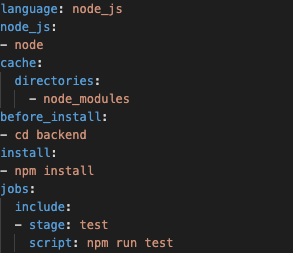

# CS3219 Task B: CRUD Application Task
**Name**: Koh Vinleon <br/>
**Matric Number**: A0202155W <br/>
**GitHub Link**: https://github.com/glatiuden/CS3219-OTOT-TaskB <br/>

## Task B1: Implementing Backend
This an attempt in building a (semi) Clean Architecture Node.js backend.

### Clean Architecture


Read more at [Clean Coder Blog](https://blog.cleancoder.com/uncle-bob/2012/08/13/the-clean-architecture.htmllink)

#### Layer description:

- Entities: Contain enterprise business model/object
- Use Cases: Contain application business rules/ logic
- Interface Adapter: Contains a set of adapters that convert data from entities/use-case layer to external dependencies such as DB or Web/HTTP
- Frameworks/ Driver: Compose of frameworks and tools (DB, Web Frameworks)

**References**
- [Using Clean Architecture for Microservice APIs in Node.js with MongoDB and Express](https://www.freecodecamp.org/news/video-clean-architecture-in-node-js/)
- [Rules for clean code](https://blog.logrocket.com/the-perfect-architecture-flow-for-your-next-node-js-project/)
- [Node clean code architecture](https://roystack.home.blog/2019/10/22/node-clean-architecture-deep-dive/)
- [Application layer - use-cases](https://khalilstemmler.com/articles/enterprise-typescript-nodejs/application-layer-use-cases/)
- [Domain-driven Design articles](https://khalilstemmler.com/articles/categories/domain-driven-design/)
- [Screaming architecture](http://blog.cleancoder.com/uncle-bob/2011/09/30/Screaming-Architecture.html)
- [What is screaming architecture](https://levelup.gitconnected.com/what-is-screaming-architecture-f7c327af9bb2)
- [Clean architecture use-case structure](https://proandroiddev.com/why-you-need-use-cases-interactors-142e8a6fe576)
- [Denormalize data](https://www.mongodb.com/blog/post/6-rules-of-thumb-for-mongodb-schema-design-part-3)
- [Mongoose Database](https://mongoosejs.com/docs/guide.html)
- [Expression documentation on API](https://expressjs.com/en/api.html)
- [Bodyparser](https://github.com/expressjs/body-parser)
- [Winston-express for HTTP logging](https://github.com/bithavoc/express-winston)
- [Winston for error logging](https://www.npmjs.com/package/winston#combining-formats)
- [Regex route express](https://www.kevinleary.net/regex-route-express/)

### Set Up
**Database Used**: Atlas MongoDB
**Third Party API Used**: Winston Loggers, Nodemon
Please ensure you are in the `/backend` folder (`cd backend`). 

#### Design
- All the endpoints are structured in this format `{URL}/api/{COLLECTION_NAME}`.

Method | Route | Description
--- | --- | ---
POST | /api/note | Create a new note
GET | /api/note | Get all notes
GET | /api/note/:note_id | Get note by ID
PUT | /api/note | Update a note 
DELETE | /api/note/:note_id | Soft delete a note 
DELETE | /api/note/hard-delete/:note_id | Hard delete a note 

- The results returned by the API must be a `data`.
- For `GET`, there are two variants: one will get a specific record by `ID` while the other will get all the records from the database.
- For `DELETE`, there are two variants: one will perform a soft delete while the another will perform a hard delete.

Please create a `.env` file in the backend directory with the following credentials
```
MONGO_USERNAME="admin"
MONGO_PASSWORD="3YHYkUdqNUMykugo"
MONGO_DB="cs3219-otot-task-b"
```

#### Install the necessary modules
```
npm install
```

#### Start the server
```
npm run dev
```

#### Endpoint
- Localhost: http://localhost:5000
- Deployed Endpoint: https://asia-southeast1-cs3219-otot-task-b-325509.cloudfunctions.net/cs3219-otot-task-b-dev-app

[](https://app.getpostman.com/run-collection/15996177-e300afc6-2c27-40cc-8628-be5a541d2ddd?action=collection%2Ffork&collection-url=entityId%3D15996177-e300afc6-2c27-40cc-8628-be5a541d2ddd%26entityType%3Dcollection%26workspaceId%3D6697fc46-4dcf-48ae-809d-2103f45bab94#?env%5BCS3219-TaskB%5D=W3sia2V5Ijoibm90ZV9pZCIsInZhbHVlIjoiIiwiZW5hYmxlZCI6dHJ1ZX0seyJrZXkiOiJhY2Nlc3NfdG9rZW4iLCJ2YWx1ZSI6IiIsImVuYWJsZWQiOnRydWV9LHsia2V5IjoidXNlcl9pZCIsInZhbHVlIjoiIiwiZW5hYmxlZCI6dHJ1ZX1d)

Alternatively, you may want to import it to your workspace via the JSON link: [https://www.getpostman.com/collections/f6491072cef6295e5d56](https://www.getpostman.com/collections/f6491072cef6295e5d56)

#### Error Resiliency
- The controllers which require parameters use a validator middleware to ensure the required parameters are in place. If there are any missing parameters, the response (error) code is `422`.
- If there is an error encountered during the execution of a query, such as a record not found or due to an internal error, the error code will be `404`.

## Task B2
**Test Framework**: Mocha & Chai

The test cases are split into positive and negative test cases.
This is to ensure that the API response should be accurate (200, 404, 422).

#### Run the test locally
```
npm run test
```

The tests will perform a check on all the available requests `POST`, `GET` (get by ID & get all), `PUT` and `DELETE` (soft delete and hard delete).

#### Running the test through CI

Travis has been integrated into the repository. Similar as above, ```npm run test``` is executed whenever the codes are pushed into the repository, under the job stage `test`.

This is a screenshot of an example of the test.


**References**
- https://medium.com/@asciidev/testing-a-node-express-application-with-mocha-chai-9592d41c0083
- https://gist.github.com/cklanac/81a6f49fabb52b3c95dff397fe62c771


## Task B3
**Serverless Service**: Serverless Google Cloud Functions

This task is accomplished using the Serverless Framework via Google Cloud Functions.
A `serverless.yml` has been set up as set of instructions to deploy to Google Cloud Functions.
We can either deploy locally or via continuous delivery in Travis.

#### Deploying locally
```
npm run deploy
```

#### Deploying through CD
Similar to above, ```npm run deploy``` under the job stage `deploy` is executed whenever the codes are pushed into the repository after the `test` stage is completed. 


This is a screenshot of an example of the deployment.


The application is deployed to https://asia-southeast1-cs3219-otot-task-b-325509.cloudfunctions.net/cs3219-otot-task-b-dev-app.

**References**
- https://www.serverless.com/framework/docs/providers/google/guide
- https://blog.travis-ci.com/2019-05-30-setting-up-a-ci-cd-process-on-github

## Task B4
**Frontend Framework**: Next.js (React.js)
